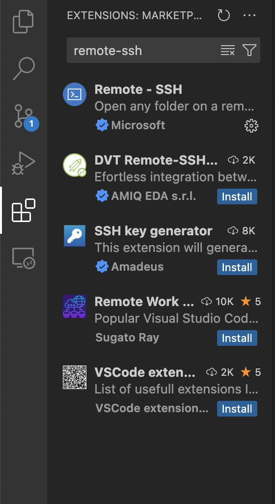
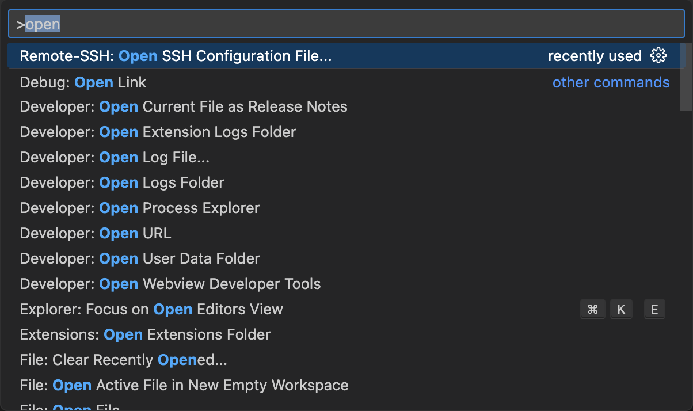
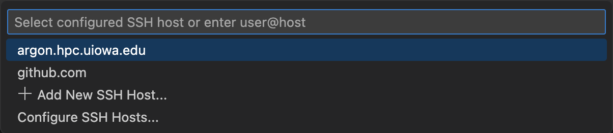
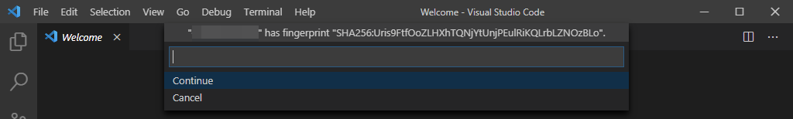
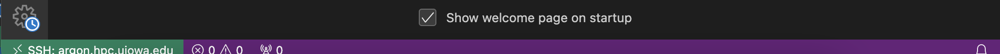

# Setting Up Your VS Code for Remote Development

This tutorial explains how to setup your Visual Studio Code to execute code on the remote server using the Remote-SSH plugin of VS code.

We'll install the required plugin and setup everything later. Before that, you need to generate the public and private key pair to communicate with the remote server. The public key is the key that can be shared with anyone. So, we'll store the public key in a specific directory in our remote server.

### Create an SSH Key:
The ssh keys are usually stored in `.ssh` folder in home directory. You can check if that folder is there in your home directory using the following command from your bash/zshell:

```ls -la ~/```

If the `.ssh` folder is not there, create one. You can do that using the following command:

```mkdir .ssh```

Now type the following command to generate the public and private key pair:

```ssh-keygen -f ~/.ssh/<preferred_key_name> -t rsa```

***NOTE: Replace the `preferred_key_name` with a suitable name you like. Make sure you don't have a file with the same name in the `.ssh` directory.***

So, we have the required public and private keys. We have to copy the contents of the `<preferred_key_name>.pub` file to a file named `known_hosts` located in the `~/.ssh` folder of the remote server. You can do it by uploading the file in the remoter server and then copying the contents from there using `FileZilla` or by using the `sftp` as shown below (not recommended):

### Upload the Public Key to Remote Server:
At first connect to the remote server using the `sftp` command from the terminal of your local machine:

```sftp <username>@<your_server_ip_or_remote_hostname>```

You'll have to login by providing your password and approving Duo Push (Two Factor Authentication).Then you should be connected to the remote server and from the terminal you can type the basic linux/unix command to navigate to different folders  in the remote server. However, to access any files or folder, you have to add `l` before the usual commands e.g., `lpwd` to print the working directory or `lcd` to change the current working directory of your local machine. Now you can use the `get` command to download file from the remote server and the `put` command to upload file to the remote server.
For example, if I want to upload a file `example.txt` from my current local directory to the remote server's `Desktop` directory, we can use the following command:

```put 'example.txt' ~/Desktop/```

***NOTE: Don't forget to put `-r` after `put` if you want to upload a directory instead of a file.***

Now let's say we're in the home directory of both the local and remote machines. So we can use the following command:

```put '~/.ssh/<preferred_key_name.pub>'```

This command will copy the file into your remote server's home directory. Then you can copy and paste the contents in the `known_hosts` file.

**Recommended(Easier) way:**

You can easily use the `cat` command in your local terminal to read the contents of the file (like `cat ~/.ssh/<preferred_key_name.pub>`) and copy it. After that, log in to your remote server using the `ssh username@remote_server_name` command. Now create (if not already there) a file called `known_hosts` using the command:

```touch known_hosts```

Open the file using `nano` editor using the command `nano known_hosts`. Paste the copied contents and then press `ctrl + o` to write and hit `Enter` to save and press `ctrl + x` to exit from `nano` editor.

### Setting Up VS Code Extension:
Open the `Extensions` panel from the left side of the VS Code's vertical panel of your local machine. You can also use shortcut `Ctrl + Shift + x`. Then search for the extension `Remote-SSH` by microsoft and install it.



### Configuring the Remote-SSH Plugin and Connecting to Your Server:
Now we need to create a SSH configuration file that VS Code can use to SSH to the server to sync files and execute code. For that open your VS Code in your local machine and press `Ctrl + Shift + p` and search for `Remote-SSH:Open SSH Configuration file`. 



You should find the config file in your `~/.ssh/` directory of your local machine. If not present, create a file called `config` in that directory using the command `touch config`. Now you should be able to select and open the file in your VS Code.

In the `config` file, write the following lines:

```
Host <your_remote_server_name>
 HostName <your_remote_server_name>
 Port 22
 User <your_username_in_that_server>
 IdentitiesOnly yes
 IdentityFile ~/.ssh/<preferred_key_name>
```

Your VS Code is now configured and ready to connect to your server. Now let's restart your VS Code and try to connect to the remote server. You can do that using the shortcut `Ctrl + Shift + p` and search for `Remote-SSH:Connect to Host`. Select that option and press `Enter`.

If you've done all the previous steps, you should see your server in the dropdown menu as you can see in the image.



So, select your remote server and press `Enter`. As it is the first time you're connecting to the server from your machine, you'll likely be prompted with the SSH Fingerprint verification dialog, like the one in the following image:



This is to ensure that you're really connecting to the server you think you're. Click `Continue`. VS Code will open a new window when a new connection is made. So, a new window will pop up and show that your remote server connection in a green box at the bottom as provided in the image below:



***NOTE: It may ask for your remote server's password one last time and a Duo Push (Two Factor Authentication) to authenticate. However, from second time, it should only ask for a Duo Push and never ask for your password again. You should type `1` and press `Enter` for a Duo Push. You have to approve the authentication from your device, and your VS Code should be able to connect to your remote server. If it asks for your password, you somehow messed up in setting up your key.***

Now you should be able to open any folder or file from the remote server from your vscode and you can also run any code from your VS Code Editor or VS Code Integrated Terminal. Next time you want to connect to your remote server, you just have to open the command palette using `Ctrl + Shift + p` and selecting the `Remote-SSH: Connect to Host` option. It'll ask to select a authentication option.

You should type `1` and press `Enter` for a Duo Push. You have to approve the authentication from your device, and your VS Code should be able to connect to your remote server.

***NOTE: Old linux versions like CentOS 7 doesn't support VS Code. It'll notify you that the OS version you're using doesn't support VS Code but it will work. However, the future versions of VS Code may not run on those OS versions.***